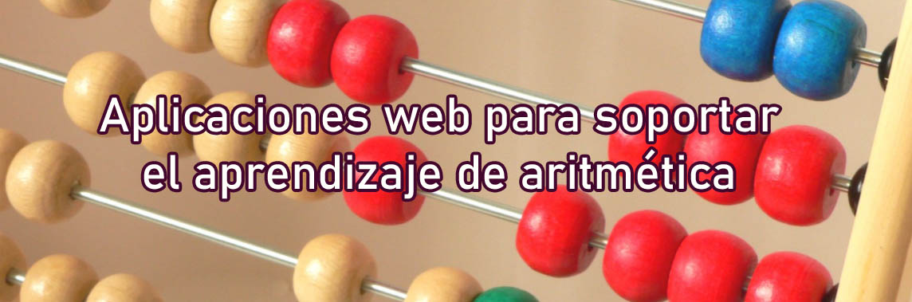

  <h1>Apps Web para Pedagogía de Aritmética</h1>
  
  
Aplicaciones web que soportan el aprendizaje de operaciones aritméticas. Este repositorio contiene cuatro diferentes aplicaciones web, desarrolladas con HTML5, CSS3 y jQuery. Son compatibles para pantallas de tablet y laptops.

  <a target="_blank" href="https://ivanrcas.github.io/puzzles-apps/"><strong>Ingresar a web</strong></a> |
  <a href="#">Desarrollador: Iván Castillo</a>

## Descripción de las actividades
### 🧩 Rompecabezas
> [--> Ver demo](https://ivanrcas.github.io/puzzles-apps/rompecabezas/ "Ingresar a rompecabezas")

<!--
Se le presenta al estudiante un conjunto de fichas compuestas por dos expresiones cada una, la primera indicará el resultado de una operación y la segunda una operación por resolver. Al resolver, la segunda expresión le indicará qué ficha escoger para continuar la secuencia de la imagen. Su finalidad, es identificar la imagen que forman las fichas unidas.
 
-->

### 🛑 Stop Aritmético
> [--> Ver demo](https://ivanrcas.github.io/puzzles-apps/stop/ "Ingresar a stop aritmético")
<!--
Los investigadores leerán las expresiones de números enteros en voz alta. Los estudiantes plasmarán cada expresión en un cuadro, donde van a diligenciar también, las partes de la expresión (el número positivo-el número negativo, según sea el caso), la operación que aplicó para resolver la expresión, el resultado y el signo del resultado. Al finalizar el proceso con cada expresión, se tendrá en cuenta el estudiante que termine de primero anunciando con voz alta STOP; este tendrá 100 puntos en cada categoría del cuadro si los datos están correctamente. Si no es así, tendrá la puntuación de 0 si la categoría del cuadro está mal diligenciada o con una respuesta equivocada, o su puntuación será 50 si escribe de manera incompleta la información. Por otra parte, los estudiantes que no alcanzaron a terminar antes que su compañero, y sus respuestas están bien, tendrán 50 puntos en cada categoría bien diligenciada. 
 
-->

### 💛 "Cónoce tu nivel de afecto"
> [--> Ver demo](https://ivanrcas.github.io/puzzles-apps/nivel-de-afecto/ "Ingresar a cónoce tu nivel de afecto")
<!--
Se presentará al estudiante un cuadro con dos categorías (familia y amigos), las cuales trabajarán en base a dos ítems (situaciones positivas y situaciones negativas). El cual a medida que los estudiantes van identificando y diligenciando las situaciones que consideran positivas y negativas, los valores son agregados y operados. Los ítems tendrán como valor 1, en el caso de que sean situaciones positivas (situaciones de alegría, tranquilidad, de paz, satisfacción, etc); en el caso de que estas sean situaciones negativas (situaciones de tristeza, rabia, pelea, dolor, discusiones, etc) tendrán como valor -1. Al final, después de agregarles valores a cada situación, van a realizar la operación correspondiente, teniendo en cuenta, las propiedades de las operaciones con enteros. Se busca lograr que el estudiante conozca y reconozca si sus relaciones poseen más situaciones positivas que negativas, y que identifique que puede realizar o hacer para obtener un cambio en dichas relaciones.
 
-->

### 🔢 Recta Númerica

> [--> Ver demo](https://ivanrcas.github.io/puzzles-apps/recta-numerica/ "Ingresar a recta numérica")
<!--
Se le plantea al estudiante una recta numérica, donde tendrá que posicionar el número entero que se le presente. Este podrá, usar la escala que quiera, la finalidad, es que este grafique correctamente lo expuesto. Se le planteará al estudiante una serie de ejercicios, los cuales deberán ser resueltos mediante el uso de la gráfica. Se busca medir la percepción del movimiento.
-->
## Requerimientos
- jQuery
- Chrome 90.0+
- VS code 1.56.0+

## Licencia
Este proyecto se realizó con fines académicos bajo licencia <a href="LICENSE">MIT</a>.  Derechos de terceros atribuidos a jQuery y Kevin Ramos.
